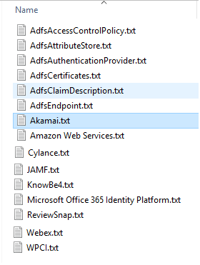

ADFS - Export

Hi There,

Export /Import ADFS Claim Rules for your relying party trusts to a text
file UncategorizedSometimes you might be bored creating similar/same claim rules
accross your enviornments. I regularly use this script to export customer's
environment when we're doing inventory & assessements.

Below method will quickly help you export your claim rules and apply to
different relying party trust

Tip:

If you customer has Azure enabled and they can use Enterprise Applications you
should try to move all applications that support SSO (single sign-on) to Azure
Enterprise Applications to give users access
through [https://myapps.microsoft.com](https://myapps.microsoft.com/) or <https://account.activedirectory.windowsazure.com/>

**Step1** : Export to a text file 

**PowerShell**

\#\#\#\#\#\#\#\#\#\#\#\#\#\#\#\#\#\#\#\#\#\#\#\#\#\#\#\#\#\#\#\#\#\#\#\#\#\#\#\#\#\#\#\#\#\#\#\#\#\#\#\#\#\#\#\#\#\#\#\#\#\#\#\#\#\#\#\#\#\#\#\#\#\#\#\#\#\#\#\#\#\#\#\#\#\#\#\#\#\#\#    

\#Author Thiago Beier thiago.beier\@gmail.com    

\#Version: 1.0 - 2019-08-15   

\#Export ADFS relying party trust 

\#Export each separately on c:\\users\\YOUR-USERNAME\\Documents\\adfs\\ folder  

\#OS Version and Build: Microsoft Windows Server 2016 Standard , 10.0.14393 N/A Build 14393 

\#Tested with SCCM Version: 1902  

\#Toronto,CANADA    

\#email: thiago.beier\@gmail.com  

\#https://www.linkedin.com/in/tbeier/  

\#\#\#\#\#\#\#\#\#\#\#\#\#\#\#\#\#\#\#\#\#\#\#\#\#\#\#\#\#\#\#\#\#\#\#\#\#\#\#\#\#\#\#\#\#\#\#\#\#\#\#\#\#\#\#\#\#\#\#\#\#\#\#\#\#\#\#\#\#\#\#\#\#\#\#\#\#\#\#\#\#\#\#\#\#\#\#\#\#\#\# 

 

\$exportpath = "\$env:USERPROFILE\\Documents\\adfs" 

 

\#creates c:\\users\\YOUR-USERNAME\\Documents\\adfs\\ folder if doesn't exist 

 

**If**(!(**test-path** "\$exportpath")) 

{ 

    **New-Item** -ItemType Directory -Force -Path \$exportpath 

 

    \#list all ADFS relying party trust and export its IssuanceTransformRules 

 

    \$listappsname = Get-AdfsRelyingPartyTrust \| **select** name 

    \#\$listappsname 

    **foreach** (\$appname **in** \$listappsname) { 

    \$fullappname = \$appname.Name 

    write-host \$appname.Name -ForegroundColor Green 

    (Get-AdfsRelyingPartyTrust -Name "\$fullappname").IssuanceTransformRules \| Out-File "\$exportpath\\\$fullappname.txt" 

    } 

 

} **else** { write-host -ForegroundColor Yellow "Directory Exists" } 

 

\#export ADFS Endpoints 

Get-AdfsEndpoint \| **fl** \* \> "\$exportpath\\AdfsEndpoint.txt" 

 

\#export ADFS Claims Description 

Get-AdfsClaimDescription \| **fl** \* \> "\$exportpath\\AdfsClaimDescription.txt" 

 

\#export ADFS Certificates 

Get-AdfsCertificate \| **fl** \* \> "\$exportpath\\AdfsCertificates.txt" 

 

\#export ADFS Authentication Provider 

Get-AdfsAuthenticationProvider \| **fl** \* \> "\$exportpath\\AdfsAuthenticationProvider.txt" 

 

\#export ADFS AttributeStore 

Get-AdfsAttributeStore \| **fl** \* \> "\$exportpath\\AdfsAttributeStore.txt" 

 

\#export ADFS Access Control Policy 

Get-AdfsAccessControlPolicy \| **fl** \* \> "\$exportpath\\AdfsAccessControlPolicy.txt" 

 

\#Show on Screen 

 

\$adfsversion = (**Get-Item** C:\\Windows\\ADFS\\Microsoft.IdentityServer.ServiceHost.exe).VersionInfo.ProductVersion  

write-host "" 

write-host "ADFS Version:" -ForegroundColor White  

\$showver = write-host -ForegroundColor Cyan \$adfsversion 

 

 

 

Files after exported

