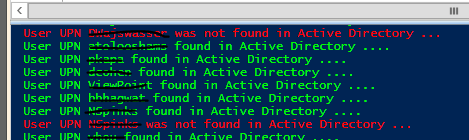
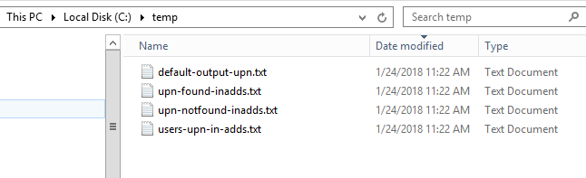

Retrieve all Office365 users and compare their UPN (userprincipalname) with ADDS

This powershell script runs better on Powershell ISE where you can make any
needed changes to its outputs.

It retrieves all MS Office 365 users from a tenant domain and check if their UPN
(UserPrincipalName) exist in ADDS (Active Directory Domain Services)

You can use this before enabling local ADDS synchronization with Office 365
using Azure AD connect to make sure if users from Office365 tenant already exist
by Displayname

 

It creates output files at c:\\temp\\ to follow up what's hapenning

 

 

You can try my other
published [script ](https://gallery.technet.microsoft.com/scriptcenter/Office365-Exchange-bb504cce?redir=0)to
connect to your tenant using a function. 

Tips:

1. you can disable powershel transcript output to a file by changing the
following

\#Start-Transcript C:\\temp\\default-powershell-output.txt

\#Stop-Transcript 

 

2. go to line 27 and change the following to FILTER by an specific OU
(organizational unit)

\#change here to set an specific OU\#get-aduser -SearchBase
"OU=SBSUsers,OU=Users,OU=MyBusiness,DC=yourdomain,DC=local" -SearchScope Subtree
\$addslogin -Properties \* \|select enabled,name,displayname,lastlogondate \>\>
C:\\temp\\users-upn-in-adds.txt 

 

 

 

**PowerShell**

\#\#\#\#\#\#\#\#\#\#\#\#\#\#\#\#\#\#\#\#\#\#\#\#\#\#\#\#\#\#\#\#\#\#\#\#\#\#\#\#\#\#\#\#\#\#\#\#\#\#\#\#\#\#\#\#\#\#\#\#\#\#\#\#\#\#\#\#\#\#\#\#\#\#\#\#\#\#\#\#  

\#Author Thiago Beier thiago.beier\@gmail.com  

\#Version: 1.1 - 2019-05-07 

\#Removed extra del command after del C:\\temp\\upn-found-inadds.txt  line 

\#Toronto,CANADA  

\#Powershell Functions To Manager Office 365, Exchange Online, SharePoint and Skype for Business.  

\#Before using this please check the PowerShell modules required  

\#\#\#\#\#\#\#\#\#\#\#\#\#\#\#\#\#\#\#\#\#\#\#\#\#\#\#\#\#\#\#\#\#\#\#\#\#\#\#\#\#\#\#\#\#\#\#\#\#\#\#\#\#\#\#\#\#\#\#\#\#\#\#\#\#\#\#\#\#\#\#\#\#\#\#\#\#\#\#\#  

 

\#Redirects all powershell output to a file 

**Start-Transcript** C:\\temp\\default-output-upn.txt 

 

**del** C:\\temp\\users-upn-**in**-adds.txt 

**del** C:\\temp\\upn-found-inadds.txt 

 

\$users = Get-MSOLUser -All \| **select** UserPrincipalName 

**foreach** (\$upn **in** \$users) { 

\$upn = (\$upn -split 'UserPrincipalname=')[1] -split '}' 

\$upn = (\$upn -split '\@')[0] 

Write-Host User \$upn found **in** Active Directory .... -ForegroundColor Green 

 

**ForEach** (\$addslogin **in** \$upn) { 

**try**  

{ 

\#change here to set an specific OU 

\#get-aduser -SearchBase "OU=SBSUsers,OU=Users,OU=MyBusiness,DC=yourdomain,DC=local" -SearchScope Subtree \$addslogin -Properties \* \|select enabled,name,displayname,lastlogondate \>\> C:\\temp\\users-upn-in-adds.txt 

get-aduser \$addslogin -Properties \* \| **select** name,displayname,samaccountname,lastlogondate \>\> C:\\temp\\users-upn-**in**-adds.txt 

\$addslogin \>\> C:\\temp\\upn-found-inadds.txt 

 

} 

**Catch** { 

        write-Host User \$addslogin was not found **in** Active Directory ... -ForegroundColor red  

        \$addslogin \>\> C:\\temp\\upn-notfound-inadds.txt 

        } 

    } 

 

} 

 

 

**Stop-Transcript** 

 
