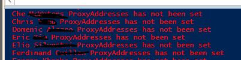

Check ADDS attributes (email, proxysmtpaddresses)

This powershell script runs better on Powershell ISE where you can make any
needed changes to its outputs.

It retrieves all ADDS users from with Email and ProxyStmpAddresses set on ADDS
(it's fully useful before you need to enable ADDS sync to Office365 using Azure
AD Connect).

 

you can redirect the ELSE output to a TXT file as you can see by removing the
"\#" before \>\> 

\#\>\> C:\\temp\\hasnot.txt 

 

**PowerShell**

\#Script1 

 

\#\#\#\#\#\#\#\#\#\#\#\#\#\#\#\#\#\#\#\#\#\#\#\#\#\#\#\#\#\#\#\#\#\#\#\#\#\#\#\#\#\#\#\#\#\#\#\#\#\#\#\#\#\#\#\#\#\#\#\#\#\#\#\#\#\#\#\#\#\#\#\#\#\#\#\#\#\#\#\#\#\#\#\#\#\#\#\#\#\# 

\#Author Thiago Beier thiago.beier\@gmail.com  

\#Version: 1.0  

\#Toronto,CANADA  

\#Powershell Functions To verify if a user has the proxyaddresses attribute set in ADDS 

\#\#\#\#\#\#\#\#\#\#\#\#\#\#\#\#\#\#\#\#\#\#\#\#\#\#\#\#\#\#\#\#\#\#\#\#\#\#\#\#\#\#\#\#\#\#\#\#\#\#\#\#\#\#\#\#\#\#\#\#\#\#\#\#\#\#\#\#\#\#\#\#\#\#\#\#\#\#\#\#\#\#\#\#\#\#\#\#\#\# 

 

 

 

Import-Module ActiveDirectory 

\$users = Get-ADUser -LDAPFilter "(mail=\*)" -Properties mail,proxyaddresses -ResultSetSize \$null 

 

**foreach**(\$user **in** \$users){ 

    **if**(\$user.proxyaddresses -contains "smtp:\$(\$user.mail)"){ 

        write-host \$user.name "ProxyAddresses has been set" -ForegroundColor green 

\# \$user.proxyaddresses  

    } **else** { 

        write-host \$user.name "ProxyAddresses has not been set" -ForegroundColor red \#\>\> C:\\temp\\hasnot.txt 

            } 

} 

 

\#end 

 

\#Script2 

 

\#\#\#\#\#\#\#\#\#\#\#\#\#\#\#\#\#\#\#\#\#\#\#\#\#\#\#\#\#\#\#\#\#\#\#\#\#\#\#\#\#\#\#\#\#\#\#\#\#\#\#\#\#\#\#\#\#\#\#\#\#\#\#\#\#\#\#\#\#\#\#\#\#\#\#\#\#\#\#\#\#\#\#\#\#\#\#\#\#\#\#\#\#\#\# 

\#Author Thiago Beier thiago.beier\@gmail.com  

\#Version: 1.0  

\#Toronto,CANADA  

\#Powershell Functions To verify if a user has the Email attribute set in ADDS 

\#\#\#\#\#\#\#\#\#\#\#\#\#\#\#\#\#\#\#\#\#\#\#\#\#\#\#\#\#\#\#\#\#\#\#\#\#\#\#\#\#\#\#\#\#\#\#\#\#\#\#\#\#\#\#\#\#\#\#\#\#\#\#\#\#\#\#\#\#\#\#\#\#\#\#\#\#\#\#\#\#\#\#\#\#\#\#\#\#\#\#\#\#\#\# 

 

 

 

Import-Module ActiveDirectory 

\$users = Get-ADUser -LDAPFilter "(mail=\*)" -Properties userprincipalname,mail,proxyaddresses -ResultSetSize \$null 

 

**foreach**(\$user **in** \$users){ 

    **if**(\$user.mail -contains "\$user.userprincipalname"){ 

        write-host \$user.name "Email has been set" -ForegroundColor green 

\# \$user.proxyaddresses  

    } **else** { 

        write-host \$user.name "Email has not been set" -ForegroundColor red \#\>\> C:\\temp\\hasnot.txt 

            } 

} 

 

\#end

 
