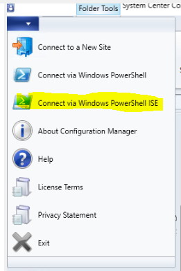
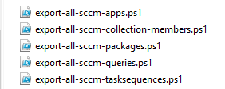

Export SCCM apps, task sequence, collections, queries and packages.

This powershell script runs better on Powershell ISE where you can make any
needed changes to its outputs. However it's fully supported on PowerShell.  
It retrieves all SCCM applications, packages, queries, collections and task
sequences and its related and dependent packages to a local folde on SCCM
server.  
To run the scripts do the following:  
1. download the scripts files (zipped file)  
2. open SCCM console and connect to SCCM using "Connect via Windows Powershell
ISE" 

 

Feel free to edit the \$exportpath and \$targetfolder variable on the PowerShell
code within each script

 

 

**PowerShell**

\$exportpath = "D:\\Export"  

\$targetfolder = "\$exportpath\\pkg"  

**if**(!(**Test-Path** -Path \$targetfolder )){  

    **New-Item** -ItemType directory -Path \$targetfolder  

    Write-Host "New folder created" -ForegroundColor Green  

}  

**else**  

{  

  Write-Host "Folder already exists" -ForegroundColor Red  

}

 
