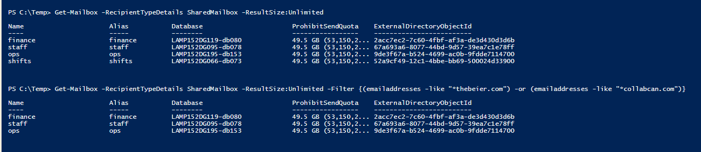

**Office 365 – Exporting Shared Mailbox Permissions to CSV**

Hi there

This script is will filter users by ProxyAddress

If you have multiple email domains and you need search across all users by Email
Domain Name (ProxyAddres) use the get-mailbox with filtered parameters to pick
the domains you want to.

Search all shared mailboxes (List them all)

Get-Mailbox -RecipientTypeDetails SharedMailbox -ResultSize:Unlimited

Search shared mailboxes with specific ProxyAddress and export to CSV

-   Collabcan.com

-   Thebeier.com

Get-Mailbox -RecipientTypeDetails SharedMailbox -ResultSize:Unlimited -Filter
{(emailaddresses -like "\*thebeier.com") -or (emailaddresses -like
"\*collabcan.com")} \|

Get-MailboxPermission \| Select Identity, User, Deny, AccessRights,
IsInherited\| Where {(\$_.user -ne "NT AUTHORITY\\SELF")}\| Export-Csv -Path
"sharedmailboxes-NonOwnerPermissions.csv" –NoTypeInformation

**CSV Export (file added to Repo)**

-   Check the file

-   Enable filter on row 1

-   Filter column “B” – user by “\@”

All users are synchronized to Azure AD

Regards,

**Thiago
Beier** [https://thiagobeier.wordpress.com](https://thiagobeier.wordpress.com/)

**Copyright © 2020 Thiago Beier Blog**
