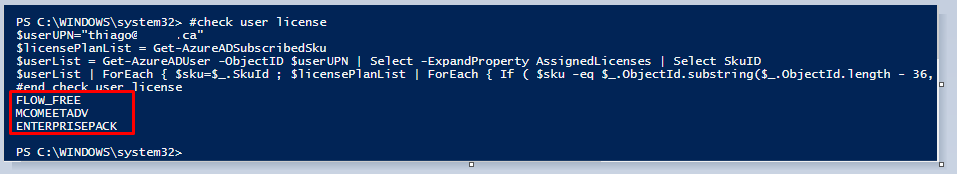

Office365 - Assign ATP licenses from a file.

Hi there

If you don't have Azure AD P1 or P2 this article it's addressed to you.

Here you can find what you need to export users’ current license status E1, E3
and ATP.

First of all, connect to your Office 365 Subscription with the following
commands:

Connect-ExchangeOnline  
Connect-AzureAD  
Connect-MsolService

**Then you can list all available licenses available under your Office 365
subscription**

**Get-MsolAccountSku**  
  
Get-AzureADSubscribedSku \| Select SkuPartNumber

**Retrieving user's license**

Get-MsolUser -UserPrincipalName thiago\@thebeier.com \| Format-List
DisplayName,Licenses

 

**Export to CSV all Enterprise E3 licensed users**

Get-MsolUser -All \| Where-Object {(\$_.licenses).AccountSkuId -match
"ENTERPRISEPACK"} \| Out-file C:\\temp\\EnterpriseE3Users.csv

**Export to CSV all Standard E1 licensed users**

Get-MsolUser -All \| Where-Object {(\$_.licenses).AccountSkuId -match
"STANDARDPACK"} \| Out-file C:\\temp\\StandardE1Users.csv

**Export to CSV all Enterprise ATP licensed users**

Get-MsolUser -All \| Where-Object {(\$_.licenses).AccountSkuId -match
"ATP_ENTERPRISE"} \| Out-file C:\\temp\\EnterpriseATPUsers.csv

**Assigning ATP licenses to E1 and E3 users.**

Get-MsolUser -All \| Where-Object {(\$_.licenses).AccountSkuId -match
"ENTERPRISEPACK"} \| Set-MsolUserLicense -AddLicenses "tenant:ATP_ENTERPRISE" 

  Get-MsolUser -All \| Where-Object {(\$_.licenses).AccountSkuId -match
"STANDARDPACK"} \| Set-MsolUserLicense -AddLicenses "tenant:ATP_ENTERPRISE" 

 

 

 

**PowerShell**

\#\#\#\#\#\#\#\#\#\#\#\#\#\#\#\#\#\#\#\#\#\#\#\#\#\#\#\#\#\#\#\#\#\#\#\#\#\#\#\#\#\#\#\#\#\#\#\#\#\#\#\#\#\#\#\#\#\#\#\#\#\#\#\#\#\#\#\#\#\#\#\#\#\#\#\#\#\#\#\#\#\#\#\#\#\#\#\#\#\#\#\#\#\#\#\#\#\#\#\#\#\#\#\#\#\#\#\#\#\#\#\#\#\#\#\#\#\#\#\#\#\#\#\#\#\#\#\#\#\#\#\#\#\#\#\#\#\#\#\#\#\#\#\#\#\#\#\#\#\#\#\#\#\#\#\#\#\#\#\#\#\#\#\#\#\#\#\#\#\#\#\#\#\#\#\#\#\#\#\#\#\#\#\#\#\#\#\#\#\#\#\#\#\#\#\#\#\#\#\#\#\#\#\#\#\#\#\#\#\#\#\#\#\#\#\#\#\#\#\#\#\#\#\#\#\#\#\#\#\#\#\#\#\#\#\#\#\#\# 

\# Author Thiago Beier thiago.beier\@gmail.com    

\# Version: 1.0 - 2020-03-09   

\# Assign ATP licenses to Users from TXT file 

\# Toronto, CANADA    

\# Email: thiago.beier\@gmail.com  

\# https://www.linkedin.com/in/tbeier/  

\# https://twitter.com/thiagobeier 

\# thiagobeier.wordpress.com 

\#\#\#\#\#\#\#\#\#\#\#\#\#\#\#\#\#\#\#\#\#\#\#\#\#\#\#\#\#\#\#\#\#\#\#\#\#\#\#\#\#\#\#\#\#\#\#\#\#\#\#\#\#\#\#\#\#\#\#\#\#\#\#\#\#\#\#\#\#\#\#\#\#\#\#\#\#\#\#\#\#\#\#\#\#\#\#\#\#\#\#\#\#\#\#\#\#\#\#\#\#\#\#\#\#\#\#\#\#\#\#\#\#\#\#\#\#\#\#\#\#\#\#\#\#\#\#\#\#\#\#\#\#\#\#\#\#\#\#\#\#\#\#\#\#\#\#\#\#\#\#\#\#\#\#\#\#\#\#\#\#\#\#\#\#\#\#\#\#\#\#\#\#\#\#\#\#\#\#\#\#\#\#\#\#\#\#\#\#\#\#\#\#\#\#\#\#\#\#\#\#\#\#\#\#\#\#\#\#\#\#\#\#\#\#\#\#\#\#\#\#\#\#\#\#\#\#\#\#\#\#\#\#\#\#\#\#\#\#   

 

 

\$userlist = **Get-Content** .\\users.txt 

\#where users.txt has users formated as UPN or email address as thiago\@thebeier.com  

**foreach** (\$user **in** \$userlist) { 

write-host "Assigning license to user:" \$user -ForegroundColor Blue 

 

\#assign license 

\$userUPN = "\$user" 

\$planName="ATP_ENTERPRISE" 

\$License = **New-Object** -TypeName Microsoft.Open.AzureAD.Model.AssignedLicense 

\$License.SkuId = (Get-AzureADSubscribedSku \| Where-Object -Property SkuPartNumber -Value \$planName -EQ).SkuID 

\$LicensesToAssign = **New-Object** -TypeName Microsoft.Open.AzureAD.Model.AssignedLicenses 

\$LicensesToAssign.AddLicenses = \$License 

Set-AzureADUserLicense -ObjectId \$userUPN -AssignedLicenses \$LicensesToAssign 

 

}

 thanks,

**Thiago Beier**
