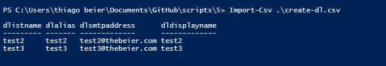

Create a Distribution List (DL) from CSV on Office 365

Hi There,

This script will help you to create Distribution Lists (DL) from a CSV file and
will hide all those DLs (Distribution Lists) from the GAL (Global Address List).

We had to use a similar script to create Temporary DLs during a migration
process (with similar names however with -Mig on its name).

You can also combine this script with another one to add members to DL
(Distribution Lists) as well.

**Testing the csv file:**

*Import-Csv .\\create-dl.csv {added to the repo}*

**You should see the following**

After

https://gallery.technet.microsoft.com/site/view/file/226392/1/3.png

https://gallery.technet.microsoft.com/site/view/file/226392/1/3.png

https://gallery.technet.microsoft.com/site/view/file/226392/1/3.png

**PowerShell**

\#\#\#\#\#\#\#\#\#\#\#\#\#\#\#\#\#\#\#\#\#\#\#\#\#\#\#\#\#\#\#\#\#\#\#\#\#\#\#\#\#\#\#\#\#\#\#\#\#\#\#\#\#\#\#\#\#\#\#\#\#\#\#\#\#\#\#\#\#\#\#\#\#\#\#\#\#\#\#\#\#\#\#\#\#\#\#\#\#\#\#     

\# Author Thiago Beier thiago.beier\@gmail.com     

\# Version: 2.0 - 2020-MAI-01    

\# Create a DL (Distribution List on Office 365) from CSV file 

\# Toronto,CANADA     

\# Email: thiago.beier\@gmail.com   

\# https://www.linkedin.com/in/tbeier/   

\# https://thigobeier.wordpress.com 

\#\#\#\#\#\#\#\#\#\#\#\#\#\#\#\#\#\#\#\#\#\#\#\#\#\#\#\#\#\#\#\#\#\#\#\#\#\#\#\#\#\#\#\#\#\#\#\#\#\#\#\#\#\#\#\#\#\#\#\#\#\#\#\#\#\#\#\#\#\#\#\#\#\#\#\#\#\#\#\#\#\#\#\#\#\#\#\#\#\#\#  

Import-Csv .\\create-dl.csv \| foreach {

write-host "Creating DL:" \$_.dlistname -ForegroundColor Blue

write-host \$_.dlistname -ForegroundColor green

New-DistributionGroup -Name \$*.dlistname -Alias \$*.dlalias -DisplayName
\$*.dldisplayname -PrimarySmtpAddress \$*.dlsmtpaddress -Type security

write-host \$_.dlalias -ForegroundColor Yellow

Set-DistributionGroup \$_.dlistname -HiddenFromAddressListsEnabled \$True

}
