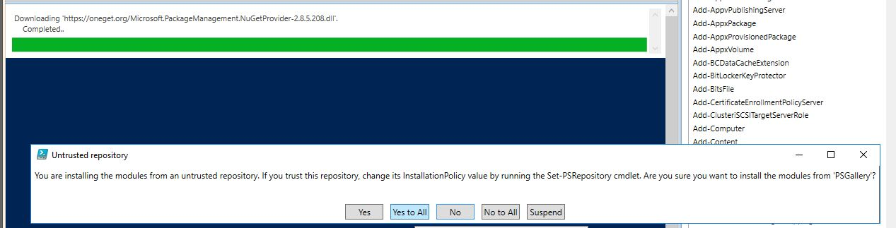

Creates a Standard User for ADDS and Office365 Management

This powershell script runs better on Powershell ISE where you can make any
needed changes to its outputs.

It creates a standard user for ADDS and Office 365 Management when you have a
multi-tenant management scenario.

If chekcs if the user exist in ADDS (Active Directory Domain Services) or in
Office 365 and creates where it's needed.

For Office 365 side creation it also sets the new standard users as a Global
Administrator.

This powershell script it's for onboarding new customers when you're creating a
new ADDS and Office365 tenant or migrating into a new one.

If the user exists in one side - ADDS or Office 365 it will creates only where
it doesn't exist with the NEW GENERATED password as mentioned on the script.

 

You should run the following in local ADDS (global catalog) from where you
should run this script beforehand - **you might have to interact with allowing
actions when prompted by **Selecting YES fand YES to All.

Install-Module MSOnline

Install-Module AzureAD

 

 

**PowerShell**

\# Copyright (C) 2019 by Thiago Beier (thiago.beier\@gmail.com)     

\# Toronto, CANADA V1.1   

\# All Rights Reserved.     

\# This Script Creates a standard user for management at local AD (Active Directory) and at Office 365  

\# Used for on-boarding process and also for correct missing steps on on-boarding processes  

\# //this script asks for your Offcie 365 tenant credentials  

\# //It shoudl be run from local ADDS - Global catalog with internet access to https://portal.office.com   

\# //please run the following before you start using this script  

\# Install-Module MSOnline  

\# Install-Module AzureAD  

\# //Be aware if the users exists in one side it won't be overwrited, deleted, removed or re-added   

\# //It only creates the standard user support\@tenantdomainname where is missing  

\# // you have the variable \$OU = "CN=Managed Service Accounts,DC=MYDOMAIN,DC=LOCAL" - that's your default OU or container for Managed Service Accounts  

\# // you have the variable -UserPrincipalName "\$Username\@mydomain.local" - that corresponds to you local ADDS FQDN - you might need make changes if you have Azure AD connect in your deployment  

\#connect to tenant  

\$domainname = **Read-Host** -Prompt "Enter your tenant domain"  

\$AdminName = **Read-Host** -Prompt  "Enter your tenant admin user" \#// we have a standard user support on each Office 365 tenant and this user should exists on each local ADDS  

**Read-Host** -Prompt "Enter your tenant admin user password" -AsSecureString \| **ConvertFrom-SecureString** \| Out-File cred.txt  

\$Pass = **Get-Content** cred.txt \| **ConvertTo-SecureString**  

\$cred = **new-object** -typename System.Management.Automation.PSCredential -argumentlist \$AdminName, \$Pass  

Import-Module MSOnline  

 

\#DN for your internal domain name / FQDN 

\$addsprefix = **Read-Host** -Prompt "Enter your ADDS prefix i.e.: tecbis.local type tecbis"  

\$addssuffix = **Read-Host** -Prompt "Enter your ADDS suffix i.e.: tecbis.local type local"  

\$OU = "CN=Managed Service Accounts,DC=\$addsprefix,DC=\$addssuffix" 

write-host \$OU -ForegroundColor Cyan 

 

\$upnadds = **Read-Host** -Prompt "Enter your routed domain UPN i.e.: thebeier.com" \#if you use this please comment lind \#93 and uncoment line \#94 

 

\# Import active directory module for running AD cmdlets  

Import-Module activedirectory  

\#Store the data from ADUsers.csv in the \$ADUsers variable  

\$Firstname = "GMSAdmin" 

\$Lastname = "Account" 

\$ADUsers = "GMSAdmin"  

\#Loop through each row containing user details in the CSV file   

**foreach** (\$User **in** \$ADUsers)  

{  

    \#generate user password from DinoPass - awesome project with strong password generator  

    \$URI = "http://www.dinopass.com/password/strong"  

    \$HTML = Invoke-WebRequest -Uri \$URI  

    \$html.content  

    \#Read user data from each field in each row and assign the data to a variable as below  

    \$Username     = \$User  

    \#\$Password     = \$User.password  

    \$Firstname     = \$User  

    \#\$Lastname     = \$User.lastname  

    \$OU = "CN=Managed Service Accounts,DC=\$addsprefix,DC=\$addssuffix" 

    \$email      = \$User  

    \$streetaddress = \$User.streetaddress  

    \$city       = \$User.city  

    \$zipcode    = \$User.zipcode  

    \$state      = \$User.state  

    \$country    = \$User.country  

    \$telephone  = \$User.telephone  

    \$jobtitle   = \$User.jobtitle  

    \$company    = \$User.company  

    \$department = \$User.department  

    \$Password = \$html.content  

    \#Check to see if the user already exists in AD  

    **if** (Get-ADUser -F {SamAccountName -eq \$Username})  

    {  

         \#If user does exist, give a warning  

         **Write-Warning** "A user account with username \$Username already exist in Active Directory."  

    }  

    **else**  

    {  

        \#User does not exist then proceed to create the new user account 

        write-host \$Username -ForegroundColor Yellow  

        write-host \$Firstname -ForegroundColor Yellow  

        write-host \$OU -ForegroundColor Yellow  

 

        \#warning 

        **Write-Warning** "A user account with username \$Username doesn't exist in Active Directory."  

        **Write-Warning** "Creating the user: \$Username in Active Directory."  

 

        \#Account will be created in the OU provided by the \$OU variable read from the CSV file  

        New-ADUser -Name \$Username -SamAccountName \$Username -UserPrincipalName "\$Username\@\$addsprefix.\$addssuffix" -Path \$OU -AccountPassword (**convertto-securestring** \$Password -AsPlainText -Force) -ChangePasswordAtLogon \$false 

        \#New-ADUser -Name \$Username -SamAccountName \$Username -UserPrincipalName "\$Username\@\$upnadds" -Path \$OU -AccountPassword (convertto-securestring \$Password -AsPlainText -Force) -ChangePasswordAtLogon \$false 

        Get-ADUser -Identity \$Username \| Set-ADUser -PasswordNeverExpires:\$true   

        Get-ADUser -Identity \$Username \| Set-ADUser -CannotChangePassword:\$true   

    }  

\#Check to see if the user already exists in Office365  

    \$msolupn = "\$Username\@\$domainname"  

    \$upn = \$msolupn  

    \$User = Get-MsolUser -UserPrincipalName \$upn -ErrorAction SilentlyContinue  

    \$User  

    **If** (\$User -ne \$Null) {   

    **Write-Warning** "A user account with username \$upn already exist in Office 365."  

} **Else** {  

    Write-host "A user account with username \$upn doesn't exist in Office 365" -ForegroundColor Yellow  

    \#create office365 account  

            \$msolupn = "\$Username\@\$domainname"  

            \$msolupn  

            New-MsolUser -UserPrincipalName \$msolupn -DisplayName \$Username -FirstName \$Username  

            Add-MsolRoleMember -RoleName “Company Administrator” –RoleMemberEmailAddress \$msolupn  

            Set-MsolUserPassword -userPrincipalName \$msolupn -NewPassword \$Password -ForceChangePassword \$false  

}  

Write-Host "\#\#\#\#\#\#\#\#\#\#\#\#\#\#\#\#\#\#\#\# Username \#\#\#\#\#\#\#\#\#\#\#\#\#\#\#\#\#\#\#\#\#\#\#\#\#\#\#" -ForegroundColor Green  

\#write-host "Username"  

write-host  \$Username -ForegroundColor Yellow  

Write-Host ""  

Write-Host "\#\#\#\#\#\#\#\#\#\#\#\#\#\#\#\#\#\#\#\# Password \#\#\#\#\#\#\#\#\#\#\#\#\#\#\#\#\#\#\#\#\#\#\#\#\#\#\#" -ForegroundColor Green  

\#Write-Host "Password"  

write-host \$Password -ForegroundColor Yellow  

Write-Host ""  

} 

 
