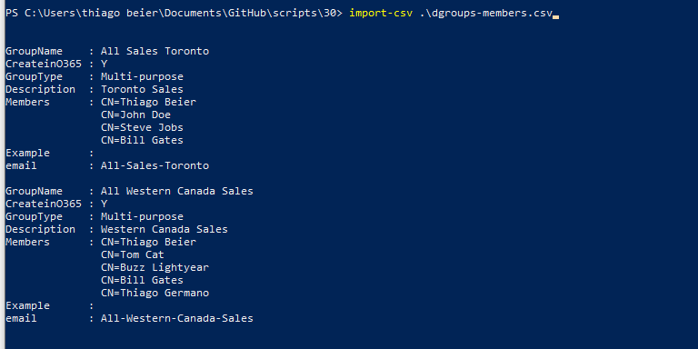

**ADDS - Creating Distribution Groups in Active Directory from CSV**

Hi there

This script is will create Distribution Groups in Active Directory from CSV with
prefix avoiding duplicate entries. It checks if the Group already exists by
Name/Displayname and CN attribute against ADDS.

To avoid that we have the following script

-   **Prefix** : "D-CA-"

-   Be aware that this CSV file format it’s an export from Lotus Notes
    Distribution Group and we used to populate ADDS (with synced objects to
    Cloud:Office 365 / Exchange On-line)

\#\#\#\#\#\#\#\#\#\#\#\#\#\#\#\#\#\#\#\#\#\#\#\#\#\#\#\#\#\#\#\#\#\#\#\#\#\#\#\#\#\#\#\#\#\#\#\#\#\#\#\#\#\#\#\#\#\#\#\#\#\#\#\#\#\#\#\#\#\#\#\#\#\#\#\#\#\#\#\#\#\#\#\#\#\#\#\#\#\#\#\#\#\#\#\#\#\#\#\#\#\#\#\#\#\#\#\#\#\#\#\#\#\#\#\#\#\#\#\#\#\#\#\#\#\#\#\#\#\#\#\#\#\#\#\#\#\#\#\#\#\#\#\#\#\#\#\#\#\#\#\#\#\#\#\#\#\#\#\#\#\#\#\#\#\#\#\#\#\#\#\#\#\#\#\#\#\#\#\#\#\#\#\#\#\#\#\#\#\#\#\#\#\#\#\#\#\#\#\#\#\#\#\#\#\#\#\#\#\#\#\#\#\#\#\#\#\#\#\#\#\#\#\#\#\#\#\#\#\#\#\#\#\#\#\#\#\#\#

\# Author Thiago Beier thiago.beier\@gmail.com

\# Version: 1.0 - 2020-07-16

\#

\# Create Distribution Groups in ADDS

\# Create a DG if doesn't exist

\# Create all DG with a prefix "D-CA-" from CSV file

\# DG groups need mail and proxyaddresses attributes in AD to work after they're
synced to AzureAD/Office365 tenant

\# You can add, replace, remove any attribute as needed.  
\# \$dgemail it’s the group-name + emaildomain “\@thebeier.com” on the script

\# You need to have your CSV file ready to run no blank spaces on GroupName,
email address.

\#

\# Toronto, CANADA

\# Email: thiago.beier\@gmail.com

\# https://www.linkedin.com/in/tbeier/

\# https://twitter.com/thiagobeier

\# https://thiagobeier.wordpress.com

\#\#\#\#\#\#\#\#\#\#\#\#\#\#\#\#\#\#\#\#\#\#\#\#\#\#\#\#\#\#\#\#\#\#\#\#\#\#\#\#\#\#\#\#\#\#\#\#\#\#\#\#\#\#\#\#\#\#\#\#\#\#\#\#\#\#\#\#\#\#\#\#\#\#\#\#\#\#\#\#\#\#\#\#\#\#\#\#\#\#\#\#\#\#\#\#\#\#\#\#\#\#\#\#\#\#\#\#\#\#\#\#\#\#\#\#\#\#\#\#\#\#\#\#\#\#\#\#\#\#\#\#\#\#\#\#\#\#\#\#\#\#\#\#\#\#\#\#\#\#\#\#\#\#\#\#\#\#\#\#\#\#\#\#\#\#\#\#\#\#\#\#\#\#\#\#\#\#\#\#\#\#\#\#\#\#\#\#\#\#\#\#\#\#\#\#\#\#\#\#\#\#\#\#\#\#\#\#\#\#\#\#\#\#\#\#\#\#\#\#\#\#\#\#\#\#\#\#\#\#\#\#\#\#\#\#\#\#\#

clear

\$dt=get-date -format yyyy-MM-dd-hhmm

Start-Transcript log-\$dt.txt

\$file=IMPORT-CSV .\\dgroups-members.csv

\$dgemail = \$null

\$dgname = \$null

\$groupobjid = \$null

FOREACH (\$line in \$file)

{

\$dgemail = \$line.email+"\@thebeier.com"

\$dgname = "D-CA-"+\$line.GroupName

write-host "setting DG email address \$dgemail to" \$dgname -ForegroundColor
Green

\# If the group exists, inform, if it does not exist also inform.

If (Get-ADGroup -Filter \* \| where {\$_.Name -like \$dgname})

{

\$dgname

Write-Host "\$dgname already exists in Active Directory" -ForegroundColor Green

\$groupobjid = (Get-ADGroup -Filter \* \| where {\$_.Name -like
"\$dgname"}).ObjectGUID

\$groupobjid

Set-ADGroup \$dgname -Add \@{mail = "\$dgemail"}

Set-ADGroup \$dgname -Add \@{proxyAddresses = "SMTP:\$dgemail"}

}

Else

{

Write-Host "I am sorry, \$dgname does not exist." -ForegroundColor RED

\$OUpath="OU=DistributionGroups,DC=thebeier,DC=local"

write-host "creating group:" \$dgname -ForegroundColor Yellow

New-ADGroup -Name "\$dgname" -SamAccountName "\$dgname" -GroupCategory
Distribution -GroupScope Universal -Path \$OUpath -Description
\$line.Description

Set-ADGroup \$dgname -Add \@{mail = "\$dgemail"}

Set-ADGroup \$dgname -Add \@{proxyAddresses = "SMTP:\$dgemail"}

}

}

Stop-Transcript

CSV file

All users are synchronized to Azure AD

Regards,

**Thiago
Beier** [https://thiagobeier.wordpress.com](https://thiagobeier.wordpress.com/)

**Copyright © 2020 Thiago Beier Blog**
