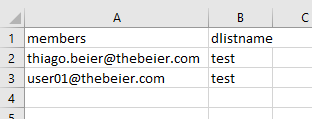

Add members to a Distribution List (DL) from a CSV file.

Hi There,

This script will help you to add members to a Distribution Lists (DL) from a CSV
file 

You just need a csv file with two columns: distribution list name (dlistname)
and member (members)

https://gallery.technet.microsoft.com/site/view/file/226396/1/5.png

You can also combine this script with another one to add members to DL
(Distribution Lists) as well.

**Testing the csv file:**

*Import-Csv .\\create-dl.csv *

**You should see the following**

https://gallery.technet.microsoft.com/site/view/file/226395/1/4.png

**PowerShell**

\#\#\#\#\#\#\#\#\#\#\#\#\#\#\#\#\#\#\#\#\#\#\#\#\#\#\#\#\#\#\#\#\#\#\#\#\#\#\#\#\#\#\#\#\#\#\#\#\#\#\#\#\#\#\#\#\#\#\#\#\#\#\#\#\#\#\#\#\#\#\#\#\#\#\#\#\#\#\#\#\#\#\#\#\#\#\#\#\#\#\#     

\# Author Thiago Beier thiago.beier\@gmail.com     

\# Version: 1.0 - 2020-FEB-28    

\# Adding user to a DL (Distribution List on Office 365) from CSV file 

\# Toronto,CANADA     

\# Email: thiago.beier\@gmail.com   

\# https://www.linkedin.com/in/tbeier/   

\# https://thigobeier.wordpress.com 

\#\#\#\#\#\#\#\#\#\#\#\#\#\#\#\#\#\#\#\#\#\#\#\#\#\#\#\#\#\#\#\#\#\#\#\#\#\#\#\#\#\#\#\#\#\#\#\#\#\#\#\#\#\#\#\#\#\#\#\#\#\#\#\#\#\#\#\#\#\#\#\#\#\#\#\#\#\#\#\#\#\#\#\#\#\#\#\#\#\#\#  

\# 

**Import-Csv** .\\add-members-to-dl01.csv \| **foreach** {  

write-host "Adding user" \$*.members "to" \$*.dlistname "DL" -ForegroundColor Yellow 

Add-DistributionGroupMember -Identity \$*.dlistname -Member \$*.members  

} 
