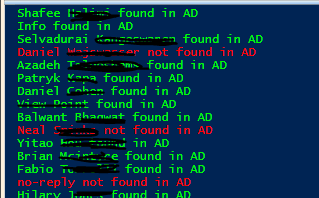

Retrieve all Office365 users and compare their displayname with ADDS

This powershell script runs better on Powershell ISE where you can make any
needed changes to its outputs.

You need to run from a local domain controller and also you need to connect to
your office365 tenant domain before.

It retrieves all MS Office 365 users from a tenant domain and check if their
DisplayName exist in ADDS (Active Directory Domain Services)

You can use this before enabling local ADDS synchronization with Office 365
using Azure AD connect to make sure if users from Office365 tenant already exist
by Displayname

It creates output files at c:\\temp\\ to follow up what's hapenning

You can try my other
published [script ](https://gallery.technet.microsoft.com/scriptcenter/Office365-Exchange-bb504cce?redir=0)to
connect to your tenant using a function. 

Tips:

1. you can disable powershel transcript output to a file by changing the
following

\#Start-Transcript C:\\temp\\default-powershell-output.txt

\#Stop-Transcript 

 

**PowerShell**

\#\#\#\#\#\#\#\#\#\#\#\#\#\#\#\#\#\#\#\#\#\#\#\#\#\#\#\#\#\#\#\#\#\#\#\#\#\#\#\#\#\#\#\#\#\#\#\#\#\#\#\#\#\#\#\#\#\#\#\#\#\#\#\#\#\#\#\#\#\#\#\#\#\#\#\#\#\#\#\#  

\#Author Thiago Beier thiago.beier\@gmail.com  

\#Version: 2.0  

\#Toronto,CANADA  

\#Powershell Functions To Manager Office 365, Exchange Online, SharePoint and Skype for Business.  

\#Before using this please check the PowerShell modules required  

\#\#\#\#\#\#\#\#\#\#\#\#\#\#\#\#\#\#\#\#\#\#\#\#\#\#\#\#\#\#\#\#\#\#\#\#\#\#\#\#\#\#\#\#\#\#\#\#\#\#\#\#\#\#\#\#\#\#\#\#\#\#\#\#\#\#\#\#\#\#\#\#\#\#\#\#\#\#\#\#  

 

\#Redirects all powershell output to a file 

**Start-Transcript** C:\\temp\\default-powershell-output.txt 

 

 

\#Delete used TXT files before next run 

**del** C:\\temp\\all-adds-users-ou.txt 

**del** C:\\temp\\displayname-found-inadds.txt 

**del** C:\\temp\\displayname-notfound-inadds.txt 

 

\#Retrieve all MSOL users from Office365 tenant domain and filter by DisplayName 

\$users = Get-MSOLUser -All \| **select** DisplayName 

 

\$upn = (\$users -split 'DisplayName=')[1] -split '}' 

\$upn = (\$upn -split '\@')[0] 

 

**foreach** (\$upn **in** \$users) { 

\$upn = (\$upn -split 'DisplayName=')[1] -split '}' 

\$upn = (\$upn -split '\@')[0] 

 

get-aduser -**filter** "Displayname -like '\$upn'" -Properties \* \|  **select** displayname,samaccountname,emailaddress,userprincipalname \>\> C:\\temp\\all-adds-users-ou.txt \#export this output to a single text file 

 

  **if** (Get-ADUser -**filter** "Displayname -like '\$upn'" -Properties \* -ErrorAction SilentlyContinue) { 

                Write-host "\$upn found in AD" -ForegroundColor Green 

                \$upn \>\> C:\\temp\\displayname-found-inadds.txt 

                }         

        **else** {Write-host "\$upn not found in AD" -ForegroundColor red 

        \$upn \>\> C:\\temp\\displayname-notfound-inadds.txt} 

 

       } 

 

 

\#Stop powershell file redirection 

**Stop-Transcript**  

 
